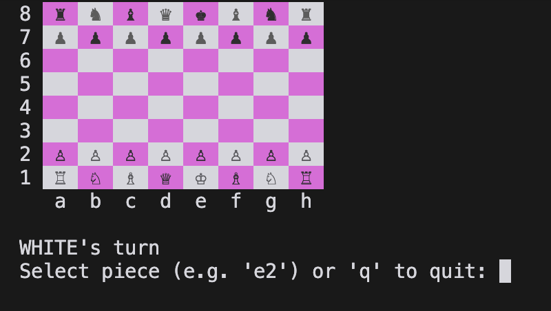

# CLI Chess
A simple CLI chess game built in Rust.

## Project Goals
- Learn Rust
- Learn about chess engines/strategy
- Get better at chess?

## Roadmap
- [x] Basic chess rules (pieces, moves, etc.)
- [ ] Advanced chess rules (en passant, castling, etc.)
- [ ] Basic bot (random moves)
- [ ] Bot Strategy (do some research on this)
- [ ] ???

